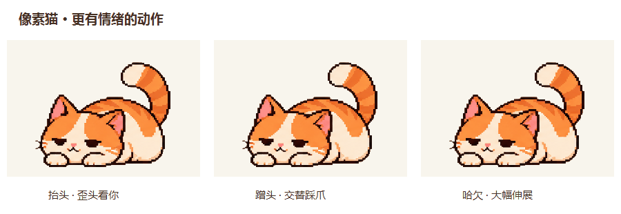
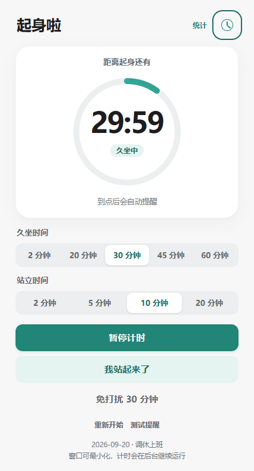
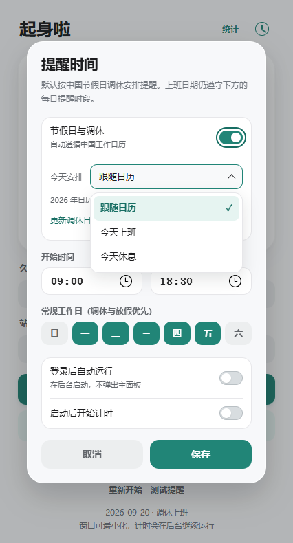
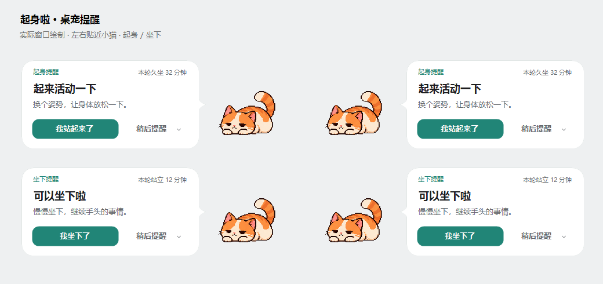

# UpYouGo

**English** | [日本語](../ja/README.md) | [한국어](../ko/README.md) | [简体中文](../../README.md) | [繁體中文](../zh-Hant/README.md)

> These documents are available in five languages. The current 1.1.1 desktop app primarily uses Simplified Chinese; choosing a documentation language does not change the app interface.

A Windows sit–stand reminder with a desktop cat companion. Includes work schedules, lunch breaks, Chinese public holidays and adjusted working days, Do Not Disturb, and local statistics.

**[Download the latest version](https://github.com/elvinzou/upyougo-releases/releases/latest)** · [User guide](USER_GUIDE.md) · [Requirements](REQUIREMENTS.md) · [Roadmap](ROADMAP.md) · [Changelog](CHANGELOG.md)

## A little companion beside your work

*An 8-second loop using the app's actual animations: looking at you on the left, a petting response in the center, and a yawn with a stretch on the right.*

| A cue to change posture | Fits your work schedule | Responsive, with quiet moments |
| --- | --- | --- |
| Reminders to stand, then sit; confirmation starts the next phase | Working hours, Chinese holiday adjustments, lunch breaks, snooze and Do Not Disturb | Head turns, tail movements and blinks; reacts to petting and moves less often while paused |

## See the main screens

<table>
<tr><th>Sitting and standing timer</th><th>Reminder times and working days</th></tr>
<tr><td align="center"></td><td align="center"></td></tr>
<tr><td>Remaining time, current phase and next action in one place. Pause, confirm your posture or turn on Do Not Disturb.</td><td>Set reminder times by weekday, follow Chinese holiday adjustments, or mark today as a workday or rest day.</td></tr>
</table>

*Screenshots show the Simplified Chinese interface with sample dates and countdowns. See the feature list and user guide for additional supported settings.*

## Reminders beside the cat

*Reminder component preview: stand reminders above, sit reminders below, with layouts on either side of the cat.*

- **Keep typing:** reminder bubbles do not take input focus.
- **A clear next step:** “我站起来了” confirms you have stood up; “我坐下了” confirms you have sat down.
- **Busy right now?** Snooze for 2 / 5 / 10 minutes or use Do Not Disturb.

## How does the cat respond?

| Situation | Animation and response |
| --- | --- |
| Keeping you company | Cycles through looking up, tail movements and blinks without requiring mouse input |
| Pointer comes near | Looks up and tilts its head toward the pointer's side |
| Click to pet | Closes its eyes, rubs its head, alternates its front paws, lifts its chin, then relaxes |
| Pet it again | Finishes the current response and can add one more round instead of repeatedly restarting |
| Time to stand | Reaches its front paws forward and stretches alongside the stand reminder |
| Time to sit | Settles into a relaxed pose alongside the sit reminder |
| Occasional larger gestures | Yawns, stretches or raises a paw to greet you, with pauses between actions |
| Dragging / paused timer | Move it to a suitable spot; autonomous movements become less frequent while paused |

The app respects Windows reduced-motion settings: autonomous animations stop, while a brief static petting response remains. The cat does not detect your posture; you still confirm each timer phase yourself.

## Installation

1. Download **UpYouGo-Setup.exe** from Releases.
2. Select a dedicated, writable installation folder, such as `D:\Apps\UpYouGo`, and install.
3. Set your sitting and standing durations and work schedule, then start the timer.

Requires Windows x64, .NET Framework (4.8 recommended), and Microsoft Edge WebView2 Runtime. The installer does not bundle the full WebView2 Runtime. Closing the main window does not quit the app; use the cat's system tray menu to exit.

## Features

- Alternating sitting and standing timers, pause/resume, posture confirmation, and snooze.
- A pixel cat companion with reminder bubbles that do not take keyboard focus.
- Working hours, weekdays, Chinese holiday adjustments, and optional lunch breaks.
- Lock/sleep handling, manual Do Not Disturb, and optional automatic fullscreen quiet mode.
- Local statistics, behavioral feedback, and startup options.
- Custom installation folders, new-version notifications, online/local updates, and rollback on failure.

## Online updates

The installed app checks this repository's stable releases at startup and every 6 hours. Click the tray notification or open “版本与更新” (Version & Updates), review the release notes, and download the update. Files are verified before the app saves and exits; the new version is then checked at startup. A failed startup restores the previous installation state.

`UpYouGo-Windows-x64.zip` supports portable use and local updates. The updater uses `.sha256` automatically. GitHub's automatically generated Source code archives contain this repository's documentation, not the application.

## Data and limitations

Settings and statistics stay in `%APPDATA%\LumbarReminder`. Updates do not delete or upload them. Network access is used for version checks, downloads, and calendar synchronization.

Updates do not resume the previous countdown; restarting follows your startup settings. A complete uninstaller and automatic cleanup of old versions are not available yet. This repository distributes binaries and user documentation; the development source remains private.

When reporting an issue, include your Windows version, app version, reproduction steps, and error message. Do not include personal records or credentials in a public issue.
